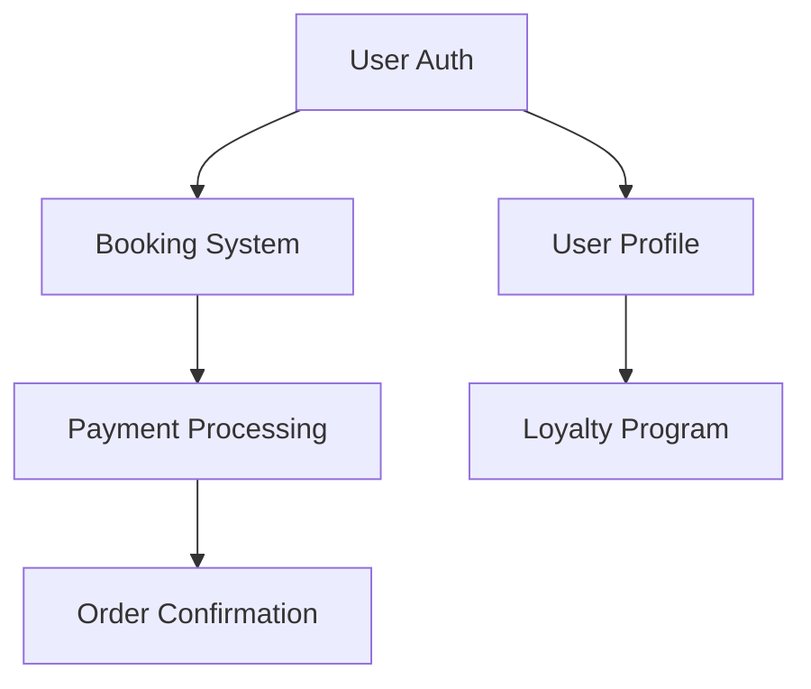

# Feature Planning Template

**Project**: [PROJECT_NAME]
**Industry**: [INDUSTRY_TYPE]
**Date**: [DATE]

---

## Feature Catalog

### 1. [CATEGORY NAME]

#### [Feature Name]
**Priority**: Must-Have | Should-Have | Nice-to-Have | Future
**Complexity**: Simple | Medium | Complex
**Evidence**: [X/15 competitors have this, Y% market adoption]

**Description**:
[2-3 sentence description of what this feature does and why it's valuable]

**User Stories**:
- As a [user type], I want to [action] so that [benefit]
- As a [user type], I want to [action] so that [benefit]

**Acceptance Criteria**:
- [ ] [Specific measurable criterion]
- [ ] [Specific measurable criterion]
- [ ] [Specific measurable criterion]

**Dependencies**:
- Requires: [Feature X, Feature Y]
- Blocks: [Feature Z]

**Technical Notes**:
- Integration: [Service name if applicable]
- Data model: [Key entities]
- Performance: [Specific requirements]

**Competitors with this feature**:
- [Competitor 1] - [Implementation notes]
- [Competitor 2] - [Implementation notes]
- [Competitor 3] - [Implementation notes]

---

[Repeat above template for each feature]

---

## Feature Matrix

| Feature | Must-Have | Should-Have | Nice-to-Have | Complexity | Competitors (%) |
|---------|-----------|-------------|--------------|------------|-----------------|
|         | ✓         |             |              | Simple     | 95%             |
|         |           | ✓           |              | Medium     | 60%             |
|         |           |             | ✓            | Complex    | 20%             |

---

## MVP Scope

### Phase 1 - Core MVP (Weeks 1-12)
**Goal**: [Describe minimum viable product goal]

**Features Included**:
1. [Feature name] - [Why essential]
2. [Feature name] - [Why essential]
3. [Feature name] - [Why essential]

**Success Metrics**:
- [Metric 1]: [Target]
- [Metric 2]: [Target]
- [Metric 3]: [Target]

### Phase 2 - Enhancement (Weeks 13-20)
**Goal**: [Describe enhancement goal]

**Features Included**:
1. [Feature name] - [Value add]
2. [Feature name] - [Value add]

## Gamification & Behavioral Hooks

- Pull modules from `packages/gamification/` (e.g., XP Loop, Streak Engine, Quest Builder).
- Capture planned mechanics, triggers, rewards, and KPIs in `docs/03-features/gamification.md`.
- Reference resulting KPIs in the PDR KPI dashboard + build plan handoff.
3. [Feature name] - [Value add]

### Phase 3 - Scale & Optimize (Weeks 21-30)
**Goal**: [Describe optimization goal]

**Features Included**:
1. [Feature name] - [Value add]
2. [Feature name] - [Value add]
3. [Feature name] - [Value add]

---

## Feature Categories

### Core Web Presence
- [ ] Homepage
- [ ] About page
- [ ] Contact page
- [ ] [Other]

### [Primary Domain - e.g., Menu/Booking/Product]
- [ ] [Feature]
- [ ] [Feature]
- [ ] [Feature]

### Customer Account & Loyalty
- [ ] User registration
- [ ] Login/authentication
- [ ] Profile management
- [ ] [Other]

### Payments & Transactions
- [ ] Payment gateway integration
- [ ] Order/booking confirmation
- [ ] Receipt generation
- [ ] [Other]

### Admin & Management
- [ ] Content management
- [ ] User management
- [ ] Analytics dashboard
- [ ] [Other]

### Marketing & Communications
- [ ] Email campaigns
- [ ] SMS notifications
- [ ] Push notifications
- [ ] [Other]

### Integrations
- [ ] [Third-party service 1]
- [ ] [Third-party service 2]
- [ ] [Third-party service 3]

---

## User Journeys

### Journey 1: [Name - e.g., "First-time Visitor to Booking"]

**Steps**:
1. User lands on homepage
2. User browses [content]
3. User [action]
4. User completes [goal]

**Features Used**:
- Step 1: [Feature A, Feature B]
- Step 2: [Feature C]
- Step 3: [Feature D, Feature E]
- Step 4: [Feature F]

**Pain Points to Address**:
- [Pain point 1] → [Solution]
- [Pain point 2] → [Solution]

**Success Metrics**:
- Conversion rate: [Target %]
- Time to complete: [Target time]
- Drop-off rate: [Target %]

---

[Repeat for additional user journeys]

---

## Feature Dependencies

### Critical Path
1. [Foundation feature] → [Dependent feature] → [Final feature]

### Parallel Development Opportunities
- Can build concurrently: [Feature A, Feature B, Feature C]
- Can build concurrently: [Feature D, Feature E]

---

## Non-Goals (Explicit Exclusions)

### MVP Non-Goals
- [ ] [Feature] - Reason: [Why excluded from MVP]
- [ ] [Feature] - Reason: [Why excluded from MVP]

### Long-term Non-Goals
- [ ] [Feature] - Reason: [Why we won't build this ever]
- [ ] [Feature] - Reason: [Why we won't build this ever]

---

## Open Questions

1. [Question about feature X]?
   - [ ] Research needed
   - [ ] Stakeholder decision needed
   - [ ] Technical spike needed

2. [Question about feature Y]?
   - [ ] Research needed
   - [ ] Stakeholder decision needed
   - [ ] Technical spike needed

---

## Prioritization Framework

### Scoring Criteria
- **Impact** (1-5): User value and business impact
- **Confidence** (1-5): How well we understand requirements
- **Effort** (1-5): Development complexity (1=easy, 5=hard)

### ICE Score = (Impact × Confidence) / Effort

| Feature | Impact | Confidence | Effort | ICE Score | Priority |
|---------|--------|------------|--------|-----------|----------|
|         | 5      | 4          | 2      | 10.0      | High     |
|         | 4      | 3          | 4      | 3.0       | Medium   |
|         | 3      | 2          | 5      | 1.2       | Low      |

---

## Next Steps

- [ ] Validate priorities with stakeholders
- [ ] Create wireframes for top 10 features
- [ ] Technical feasibility assessment
- [ ] Cost estimation
- [ ] Begin architecture design (Phase 4)

---

**Completed**: [DATE]
**Status**: ☐ Draft | ☐ Review | ☐ Approved
