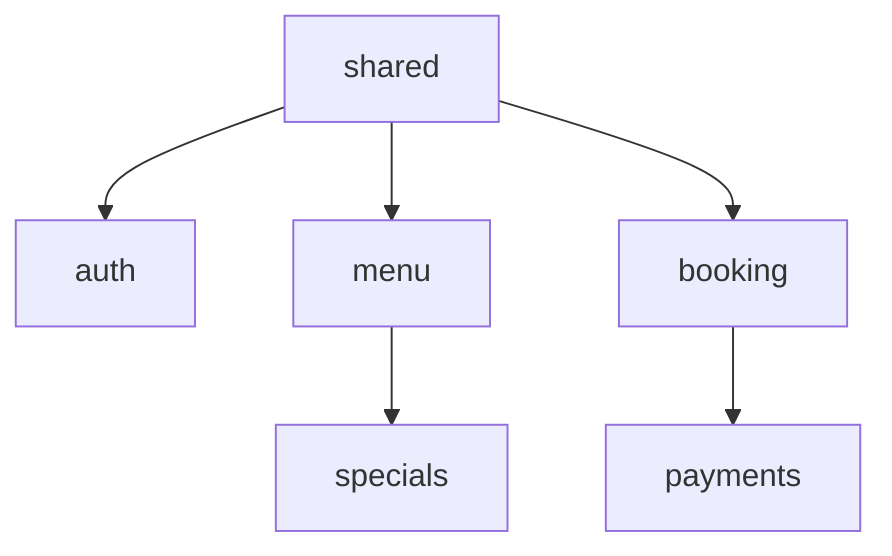
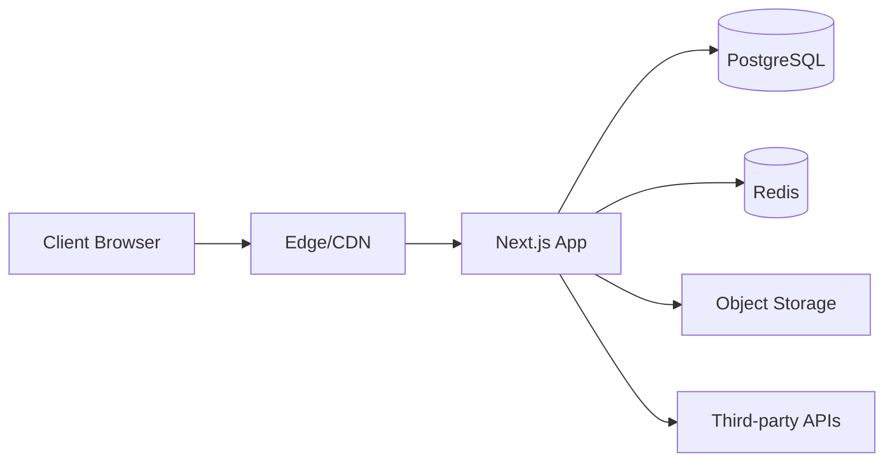
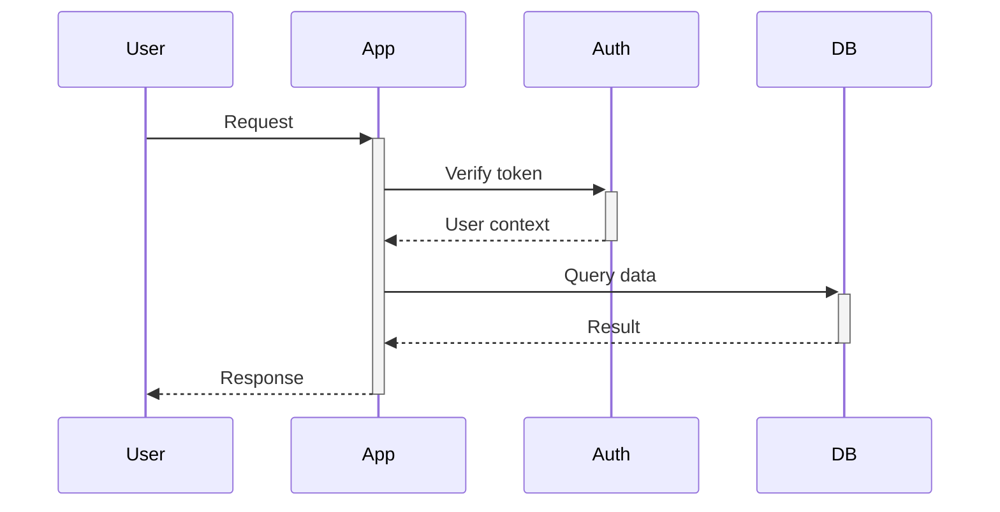
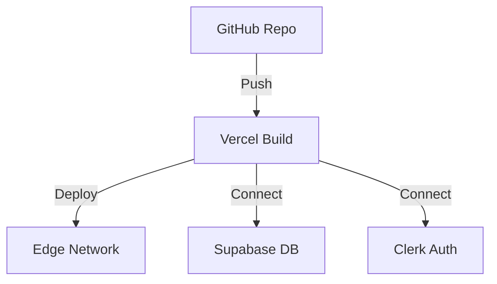

# Architecture Design Template

**Project**: [PROJECT_NAME]
**Industry**: [INDUSTRY_TYPE]
**Date**: [DATE]
**Architect**: [NAME]

---

## 1. System Overview

### Vision
[High-level description of what the system does and its key characteristics]

### Architectural Style
- [ ] Monolithic
- [ ] Microservices
- [ ] Serverless
- [ ] Hybrid: [Describe]

### Design Principles
1. [Principle 1 - e.g., Domain-Driven Design]
2. [Principle 2 - e.g., Mobile-First]
3. [Principle 3 - e.g., API-First]
4. [Principle 4 - e.g., Security by Default]

---

## 2. Domain Architecture

> **Reminder:** Every domain must be implemented using `architecture/TEMPLATE-ARCHITECTURE.md` + `architecture/DOMAIN-DRIVEN-LAYOUT.md`. When you list domains below, also detail the pages and subfolders you will scaffold under `src/domains/<domain>/` (docs, desktop/mobile pages, components, hooks, utils, tests).

### Domain Map


### Domain Definitions

#### Domain: [Name]
**Boundary**: [What's included and what's not]
**Responsibilities**:
- [Responsibility 1]
- [Responsibility 2]
- [Responsibility 3]

**Key Entities**:
- [Entity 1]
- [Entity 2]

**Dependencies**:
- Depends on: [Domain X, Domain Y]
- Consumed by: [Domain Z]

**Public Interface**:
- [Operation 1]
- [Operation 2]

---

[Repeat for each domain - typically 10-20 domains]

---

## 3. Tech Stack

### Frontend

**Framework**: [Next.js 15 | React | Vue | etc.]
**Reasoning**: [Why this choice]

**Language**: [TypeScript | JavaScript]
**Reasoning**: [Why this choice]

**Styling**: [TailwindCSS | CSS Modules | Styled Components]
**Reasoning**: [Why this choice]

**State Management**: [React Query | Redux | Zustand | Context]
**Reasoning**: [Why this choice]

**Form Handling**: [React Hook Form | Formik]
**Reasoning**: [Why this choice]

**Routing**: [App Router | Pages Router | React Router]
**Reasoning**: [Why this choice]

### Backend

**Runtime**: [Node.js | Deno | Bun]
**Reasoning**: [Why this choice]

**API Style**: [Server Actions | REST | GraphQL | tRPC]
**Reasoning**: [Why this choice]

**Validation**: [Zod | Yup | Joi]
**Reasoning**: [Why this choice]

**ORM/Query Builder**: [Prisma | Drizzle | TypeORM | Raw SQL]
**Reasoning**: [Why this choice]

### Database

**Primary Database**: [PostgreSQL | MySQL | MongoDB]
**Reasoning**: [Why this choice]

**Hosted Where**: [Supabase | Planetscale | Railway | AWS RDS]
**Reasoning**: [Why this choice]

**Caching Layer**: [Redis | Memcached | In-memory]
**Reasoning**: [Why this choice]

### Authentication

**Provider**: [Clerk | Auth0 | NextAuth | Supabase Auth]
**Reasoning**: [Why this choice]

**Methods Supported**:
- [ ] Email/Password
- [ ] Social Login (Google, Facebook, etc.)
- [ ] Phone/SMS
- [ ] Magic Links
- [ ] Passkeys

### Storage

**Images/Files**: [Cloudinary | AWS S3 | R2 | Supabase Storage]
**Reasoning**: [Why this choice]

**CDN**: [Cloudflare | Vercel | CloudFront]
**Reasoning**: [Why this choice]

### Email/SMS

**Email Provider**: [Resend | SendGrid | Postmark | SES]
**Reasoning**: [Why this choice]

**SMS Provider**: [Twilio | MessageBird | SNS]
**Reasoning**: [Why this choice]

**WhatsApp**: [Twilio | Meta Business API]
**Reasoning**: [Why this choice]

### Payments

**Gateway**: [Stripe | PayPal | Xendit | Midtrans]
**Reasoning**: [Why this choice]

**Supported Methods**:
- [ ] Credit/Debit Cards
- [ ] E-wallets (specify which)
- [ ] Bank Transfer
- [ ] QR Codes
- [ ] Cash (tracking only)

### Analytics

**Web Analytics**: [GA4 | Plausible | Fathom]
**Reasoning**: [Why this choice]

**Product Analytics**: [Mixpanel | Amplitude | PostHog]
**Reasoning**: [Why this choice]

**Error Tracking**: [Sentry | Bugsnag | Rollbar]
**Reasoning**: [Why this choice]

### Deployment

**Platform**: [Vercel | Netlify | Railway | AWS]
**Reasoning**: [Why this choice]

**CI/CD**: [GitHub Actions | GitLab CI | CircleCI]
**Reasoning**: [Why this choice]

---

## 4. Multi-Tenancy Strategy

### Approach
- [ ] Single database, tenant_id column (Row-level isolation)
- [ ] Database per tenant (Schema isolation)
- [ ] Separate deployment per tenant (Full isolation)
- [ ] Hybrid: [Describe]

### Tenant Identification
**Method**: [Domain/subdomain | Path | Header | Database lookup]

**Examples**:
- `restaurant-a.example.com` → Tenant ID: `restaurant-a`
- `example.com/tenant-b` → Tenant ID: `tenant-b`

### Data Isolation

**RLS Policies**: [Yes/No]
**Example Policy**:
```sql
CREATE POLICY tenant_isolation ON table_name
FOR ALL
USING (restaurant_id = current_setting('app.restaurant_id')::uuid);
```

**Tenant Context Injection**:
- Middleware sets tenant context
- Server actions read from headers
- Database client configured per-request

### Cost Management

**Free Tier Strategy**:
- Supabase: [Usage limits per project]
- Vercel: [Function limits, bandwidth]
- Clerk: [MAU limits]

**Scaling Approach**:
- [How to handle growth beyond free tiers]
- [When to upgrade vs optimize]

---

## 5. Security Architecture

### Authentication & Authorization

**Authentication Flow**:
1. [Step 1]
2. [Step 2]
3. [Step 3]

**Role-Based Access Control (RBAC)**:

| Role | Permissions |
|------|-------------|
| Owner | Full access to all domains |
| Manager | [Specific permissions] |
| Staff | [Specific permissions] |
| Customer | [Specific permissions] |
| Guest | [Specific permissions] |

### Data Protection

**Encryption at Rest**: [Yes/No - Provider]
**Encryption in Transit**: [TLS 1.3]

**PII Handling**:
- [ ] Minimal collection
- [ ] Encrypted storage
- [ ] Right to deletion
- [ ] Data export capability

**Sensitive Data**:
- Payment info: [Never stored | Tokenized]
- Passwords: [Hashed with bcrypt/Argon2]
- API keys: [Stored in environment variables]

### Security Headers
```javascript
{
  'X-Frame-Options': 'DENY',
  'X-Content-Type-Options': 'nosniff',
  'Referrer-Policy': 'strict-origin-when-cross-origin',
  'Permissions-Policy': 'geolocation=(self)',
  'Content-Security-Policy': '...'
}
```

### Rate Limiting

**Strategy**: [Vercel rate limiting | Upstash | Middleware]

**Limits**:
- API endpoints: [X requests per minute]
- Auth endpoints: [Y requests per minute]
- Webhook endpoints: [Z requests per minute]

### CORS Policy
```javascript
{
  origin: ['https://example.com'],
  methods: ['GET', 'POST', 'PUT', 'DELETE'],
  credentials: true
}
```

---

## 6. Performance Architecture

### Performance Budget

**Metrics**:
- First Contentful Paint (FCP): < 1.8s
- Largest Contentful Paint (LCP): < 2.5s
- Time to Interactive (TTI): < 3.8s
- Cumulative Layout Shift (CLS): < 0.1
- First Input Delay (FID): < 100ms

### Caching Strategy

**Edge Caching** (CDN):
- Static assets: [365 days]
- Images: [90 days]
- API responses: [Varies by endpoint]

**Database Query Caching**:
- Hot data: [Redis, 5 minutes]
- Cold data: [On-demand]

**Browser Caching**:
- Service Worker: [Yes/No]
- LocalStorage: [What data]
- SessionStorage: [What data]

### Code Splitting

**Strategy**: [Route-based | Component-based | Hybrid]

**Lazy Loading**:
- [ ] Images (with blur placeholders)
- [ ] Non-critical components
- [ ] Third-party scripts
- [ ] Icons and fonts

### Database Optimization

**Indexing Strategy**:
```sql
-- Primary keys
CREATE INDEX idx_user_email ON users(email);

-- Foreign keys
CREATE INDEX idx_order_user ON orders(user_id);

-- Query-specific
CREATE INDEX idx_product_category ON products(category_id, active);
```

**Connection Pooling**:
- Pool size: [X connections]
- Timeout: [Y seconds]

**Query Optimization**:
- [ ] Use prepared statements
- [ ] Avoid N+1 queries
- [ ] Paginate large result sets
- [ ] Use database views for complex queries

---

## 7. Integration Architecture

### Third-Party Services

#### [Service Name - e.g., Stripe]
**Purpose**: [Payment processing]
**Integration Type**: [REST API | Webhook | SDK]

**Auth Method**: [API Key | OAuth]

**Endpoints Used**:
- `POST /v1/payment_intents` - Create payment
- `GET /v1/customers/:id` - Fetch customer
- Webhook: `/api/webhooks/stripe` - Payment events

**Error Handling**:
- Retry strategy: [Exponential backoff]
- Fallback: [Queue for manual processing]

**Rate Limits**: [100 requests/second]

---

[Repeat for each third-party service]

---

### Webhook Handling

**Verification**:
```typescript
// Verify webhook signature
const isValid = verifySignature(payload, signature, secret);
```

**Processing**:
- [ ] Idempotency keys to prevent duplicates
- [ ] Queue-based processing for reliability
- [ ] Retry logic with exponential backoff

**Security**:
- [ ] Signature verification
- [ ] IP whitelist (if available)
- [ ] Rate limiting

---

## 8. System Diagrams

### High-Level Architecture


### Data Flow Diagram


### Deployment Architecture


---

## 9. Scalability Plan

### Vertical Scaling
- Database: [Upgrade to larger instance]
- Serverless: [Increase function memory]

### Horizontal Scaling
- [ ] Read replicas for database
- [ ] Load balancing across regions
- [ ] Distributed caching

### Bottleneck Analysis

**Potential Bottlenecks**:
1. [Database connections] → Solution: [Connection pooling]
2. [API rate limits] → Solution: [Request queuing]
3. [Image processing] → Solution: [Background jobs]

---

## 10. Disaster Recovery

### Backup Strategy

**Database**:
- Frequency: [Daily automated backups]
- Retention: [30 days]
- Testing: [Monthly restore drills]

**File Storage**:
- Frequency: [Continuous replication]
- Retention: [90 days]

### Incident Response

**Severity Levels**:
- P0 (Critical): [System down] → Response time: [15 minutes]
- P1 (High): [Feature broken] → Response time: [1 hour]
- P2 (Medium): [Degraded] → Response time: [4 hours]
- P3 (Low): [Minor issue] → Response time: [Next business day]

**Runbooks**:
- Database failure: [Runbook link]
- Auth provider down: [Runbook link]
- Payment gateway issues: [Runbook link]

---

## 11. Monitoring & Observability

### Metrics to Track

**Application**:
- Request rate
- Error rate
- Response times (p50, p95, p99)
- Active users

**Infrastructure**:
- CPU usage
- Memory usage
- Database connections
- Function invocations

### Alerting

**Critical Alerts**:
- Error rate > 5%
- Response time p95 > 3s
- Database connections > 80%

**Warning Alerts**:
- Error rate > 1%
- Response time p95 > 2s
- Disk usage > 70%

### Logging Strategy

**Log Levels**:
- ERROR: [All errors with stack traces]
- WARN: [Recoverable issues]
- INFO: [Key operations]
- DEBUG: [Development only]

**Log Aggregation**: [Vercel Logs | Datadog | New Relic]

---

## 12. Compliance & Governance

### Regulatory Compliance

- [ ] GDPR (if serving EU users)
- [ ] PCI DSS (if processing cards)
- [ ] HIPAA (if health data)
- [ ] SOC 2 (if enterprise customers)
- [ ] Local regulations: [Specify]

### Accessibility

**Target**: WCAG 2.1 Level AA

**Requirements**:
- [ ] Semantic HTML
- [ ] ARIA labels
- [ ] Keyboard navigation
- [ ] Screen reader support
- [ ] Color contrast ratios
- [ ] Focus indicators

### Audit Logging

**Events to Log**:
- User login/logout
- Data modifications
- Permission changes
- Payment transactions
- Export requests

**Retention**: [1 year minimum]

---

## Next Steps

- [ ] Review architecture with team
- [ ] Validate tech stack choices
- [ ] Prototype critical paths
- [ ] Cost estimation
- [ ] Begin database schema design (Phase 5)

---

**Completed**: [DATE]
**Status**: ☐ Draft | ☐ Review | ☐ Approved
**Reviewed By**: [Names]
