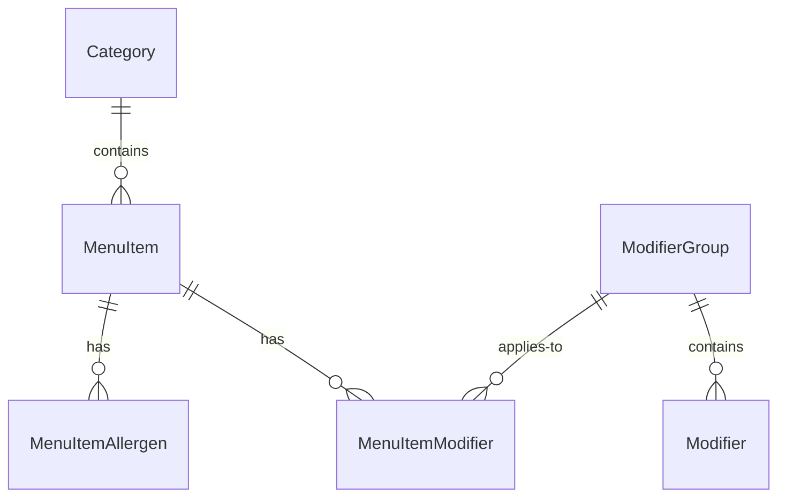
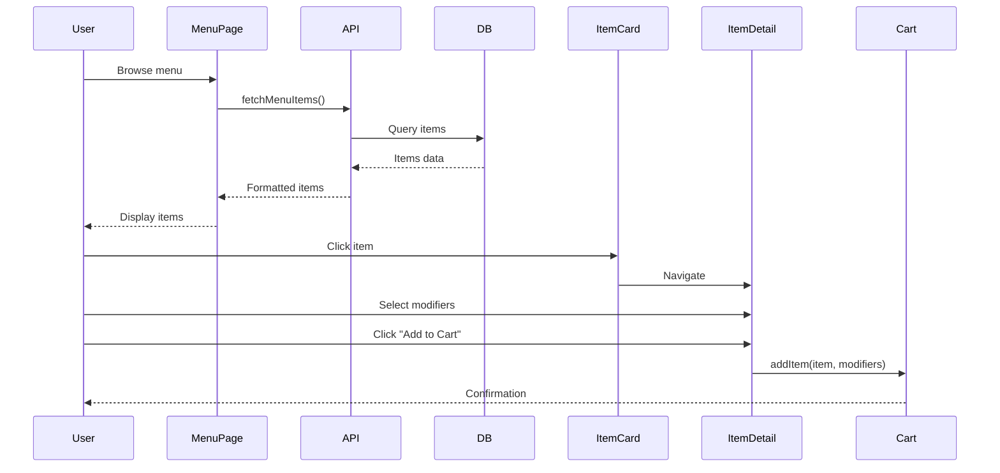

# Domain Planning Template

**Project**: [PROJECT_NAME]
**Domain**: [DOMAIN_NAME]
**Date**: [DATE]

---

## Domain Definition

### Purpose
[1-2 sentence description of what this domain is responsible for]

### Boundaries
**Included**:
- [Responsibility 1]
- [Responsibility 2]
- [Responsibility 3]

**Excluded** (belongs in other domains):
- [Not this domain's job 1]
- [Not this domain's job 2]

### Core Concepts
- [Concept 1 - e.g., "Menu Item"]
- [Concept 2 - e.g., "Category"]
- [Concept 3 - e.g., "Modifier"]

---

## Pages & Routes

### Public Routes

#### [Route Path - e.g., `/menu`]
**Page Name**: [Menu Listing Page]
**Purpose**: [Display all menu items organized by category]
**User Access**: Public | Authenticated | Admin

**Page Sections**:
1. [Section 1 - e.g., Header with categories]
2. [Section 2 - e.g., Item grid/list]
3. [Section 3 - e.g., Filters sidebar]

**Components Needed**:
- `MenuCategoryNav` - Category navigation
- `MenuItem Card` - Individual item display
- `MenuFilters` - Dietary/price filters
- `SearchBar` - Item search
- `AddToCartButton` - (if ordering enabled)

**Data Required**:
- Categories (all active)
- Menu items (filtered by category, active only)
- Allergen tags
- Dietary tags

**Operations Used**:
- `fetchCategories()`
- `fetchMenuItems(categoryId?, filters?)`
- `searchMenuItems(query)`

---

[Repeat for each route in this domain]

---

### Authenticated Routes

[Same structure as public routes]

---

### Admin Routes

[Same structure as public routes]

---

## BMAD Operations

### CRUD Operations

#### Create Operations

**Operation**: `createMenuItem`
**Input**:
```typescript
{
  name: string;
  description: string;
  price: number;
  categoryId: string;
  modifiers?: string[];
  allergens?: string[];
  dietaryTags?: string[];
  images?: string[];
  active?: boolean;
}
```

**Output**: `MenuItem`

**Validation**:
- Name: Required, 2-100 characters
- Description: Optional, max 500 characters
- Price: Required, positive number
- CategoryId: Required, must exist

**Authorization**: Admin, Manager

**Side Effects**:
- Invalidate menu cache
- Send notification to staff (optional)

**Error Cases**:
- Category not found → 404
- Duplicate name in category → 409
- Validation failure → 400

---

[Repeat for update, delete operations]

---

### Business Operations

#### Operation: `applySpecialsPricing`
**Purpose**: Calculate item price with active specials applied

**Input**:
```typescript
{
  itemId: string;
  quantity: number;
  dateTime: Date;
}
```

**Output**:
```typescript
{
  originalPrice: number;
  discountAmount: number;
  finalPrice: number;
  appliedSpecials: Special[];
}
```

**Logic**:
1. Fetch item base price
2. Fetch active specials for this item
3. Filter specials by day/time
4. Apply highest discount
5. Return pricing breakdown

**Dependencies**:
- `fetchMenuItem(id)`
- `fetchActiveSpecials(itemId, dateTime)`

---

[Repeat for other business operations]

---

### Query Operations

**Operation**: `fetchMenuWithSpecials`
**Purpose**: Get menu with current special pricing

**Caching**: 5 minutes

**Performance**: < 200ms

---

## Domain Data Model

### Entities

#### `Category`
```typescript
{
  id: string;
  name: string;
  description?: string;
  position: number;
  visible: boolean;
  restaurantId: string; // if multi-tenant
  createdAt: Date;
  updatedAt: Date;
}
```

#### `MenuItem`
```typescript
{
  id: string;
  categoryId: string;
  name: string;
  description?: string;
  price: number;
  active: boolean;
  images: string[];
  restaurantId: string; // if multi-tenant
  createdAt: Date;
  updatedAt: Date;

  // Relationships
  category?: Category;
  modifiers?: ModifierGroup[];
  allergens?: Allergen[];
  dietaryTags?: DietaryTag[];
}
```

---

[Define all entities for this domain]

---

### Relationships



---

## Component Specifications

### Component: `MenuItemCard`

**Props**:
```typescript
{
  item: MenuItem;
  showPrice?: boolean;
  showDescription?: boolean;
  onAddToCart?: (item: MenuItem) => void;
  variant?: 'compact' | 'detailed';
}
```

**State**:
- `isHovered`: boolean
- `imageLoaded`: boolean

**Behavior**:
- Click → Navigate to item detail
- Add to Cart button → Call onAddToCart
- Lazy load image with blur placeholder

**Accessibility**:
- Keyboard navigable
- Screen reader friendly
- Alt text for images

---

[Repeat for key components]

---

## Workflows

### Workflow: Customer Orders Item



---

## Validation Rules

### Input Validation

**MenuItem Name**:
- Required
- 2-100 characters
- No special characters (except: -',.)
- Unique within category

**Price**:
- Required
- Positive number
- Max 2 decimal places
- Between 0.01 and 999999.99

**Images**:
- Max 5 images
- Formats: jpg, png, webp
- Max size: 5MB each
- Min dimensions: 400x400

---

## Security & Authorization

### Role Permissions

| Operation | Guest | Customer | Staff | Manager | Owner |
|-----------|-------|----------|-------|---------|-------|
| View menu | ✅ | ✅ | ✅ | ✅ | ✅ |
| Create item | ❌ | ❌ | ❌ | ✅ | ✅ |
| Edit item | ❌ | ❌ | ❌ | ✅ | ✅ |
| Delete item | ❌ | ❌ | ❌ | ❌ | ✅ |
| Toggle active | ❌ | ❌ | ✅ | ✅ | ✅ |

### Data Access

**Row-Level Security**:
```sql
-- Customers see only active items from their restaurant
CREATE POLICY menu_customer_view ON menu_items
FOR SELECT
USING (
  active = true
  AND restaurant_id = current_setting('app.restaurant_id')::uuid
);

-- Admins see all items from their restaurant
CREATE POLICY menu_admin_all ON menu_items
FOR ALL
USING (
  restaurant_id = current_setting('app.restaurant_id')::uuid
  AND auth.role() IN ('manager', 'owner')
);
```

---

## Performance Considerations

### Caching Strategy

**Menu List**:
- Cache key: `menu:${restaurantId}:${categoryId?}:${filters?}`
- TTL: 5 minutes
- Invalidation: On any menu update

**Item Detail**:
- Cache key: `menuItem:${itemId}`
- TTL: 10 minutes
- Invalidation: On item update

### Query Optimization

**N+1 Prevention**:
```typescript
// Bad: N+1 query
const items = await db.menuItem.findMany();
for (const item of items) {
  item.category = await db.category.findUnique({ where: { id: item.categoryId } });
}

// Good: Single query with join
const items = await db.menuItem.findMany({
  include: {
    category: true,
    modifiers: true,
    allergens: true
  }
});
```

**Pagination**:
- Default: 20 items per page
- Max: 100 items per page
- Cursor-based for infinite scroll

---

## Testing Requirements

### Unit Tests
- [ ] CRUD operations
- [ ] Business logic (specials pricing)
- [ ] Validation rules
- [ ] Authorization checks

### Integration Tests
- [ ] API endpoints
- [ ] Database operations
- [ ] Cache invalidation

### E2E Tests
- [ ] Browse menu
- [ ] Search items
- [ ] Filter by dietary tags
- [ ] Add to cart (if applicable)
- [ ] Admin: Create/edit item

---

## Dependencies

### Depends On (Consumes)
- `shared/auth` - User authentication
- `shared/ui` - UI components
- `shared/lib` - Utility functions

### Consumed By (Provides to)
- `specials` domain - Menu item data
- `ordering` domain - Menu item data
- `analytics` domain - Menu view events

---

## Migration & Deployment

### Database Migrations

**Order**:
1. Create `categories` table
2. Create `menu_items` table
3. Create `modifier_groups` table
4. Create `modifiers` table
5. Create `menu_item_modifiers` junction
6. Create indexes
7. Add RLS policies

### Seed Data

**Required Seeds**:
- Default categories (if applicable)
- Sample menu items (for demo)

**Optional Seeds**:
- Allergen tags
- Dietary tags

---

## Future Enhancements

### Phase 2
- [ ] Multi-language support
- [ ] Nutritional information
- [ ] Recipe management
- [ ] Ingredient tracking
- [ ] Seasonal menus

### Phase 3
- [ ] AI-powered recommendations
- [ ] Dynamic pricing
- [ ] Menu A/B testing
- [ ] Print menu generation

---

## Notes & Open Questions

- [ ] Should we support menu variants (breakfast/lunch/dinner)?
- [ ] How to handle out-of-stock items?
- [ ] Should modifiers have their own pricing?
- [ ] Multi-currency support needed?

---

**Completed**: [DATE]
**Status**: ☐ Draft | ☐ Review | ☐ Approved
