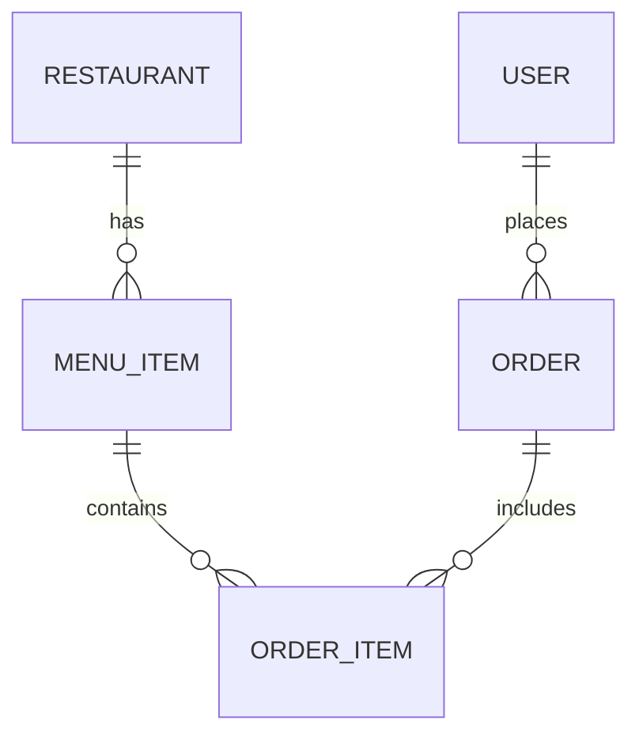

# Database Schema Template

**Project**: [PROJECT_NAME]
**Database**: [PostgreSQL/MySQL/MongoDB]
**Date**: [DATE]

---

## Tables

### [TABLE_NAME]

```sql
CREATE TABLE table_name (
  id UUID PRIMARY KEY DEFAULT gen_random_uuid(),
  name VARCHAR(100) NOT NULL,
  description TEXT,
  price DECIMAL(10,2) NOT NULL CHECK (price >= 0),
  active BOOLEAN DEFAULT true,
  restaurant_id UUID NOT NULL, -- if multi-tenant
  created_at TIMESTAMP DEFAULT NOW(),
  updated_at TIMESTAMP DEFAULT NOW(),

  CONSTRAINT fk_restaurant FOREIGN KEY (restaurant_id)
    REFERENCES restaurants(id) ON DELETE CASCADE
);

-- Indexes
CREATE INDEX idx_table_restaurant ON table_name(restaurant_id);
CREATE INDEX idx_table_active ON table_name(active) WHERE active = true;
CREATE INDEX idx_table_created ON table_name(created_at DESC);

-- RLS Policies
ALTER TABLE table_name ENABLE ROW LEVEL SECURITY;

CREATE POLICY tenant_isolation ON table_name
  FOR ALL
  USING (restaurant_id = current_setting('app.restaurant_id')::uuid);
```

**Columns**:
| Column | Type | Constraints | Description |
|--------|------|-------------|-------------|
| id | UUID | PK | Primary key |
| name | VARCHAR(100) | NOT NULL | Display name |

---

[Repeat for each table]

---

## Entity Relationship Diagram



---

## Migrations

### Migration Order
1. Create `restaurants` table (if multi-tenant)
2. Create core domain tables
3. Create junction tables
4. Add indexes
5. Add RLS policies

### Example Migration
```sql
-- migration_001_create_restaurants.sql
CREATE TABLE restaurants (
  id UUID PRIMARY KEY DEFAULT gen_random_uuid(),
  name VARCHAR(255) NOT NULL,
  slug VARCHAR(100) UNIQUE NOT NULL,
  created_at TIMESTAMP DEFAULT NOW()
);
```

---

**Completed**: [DATE]
