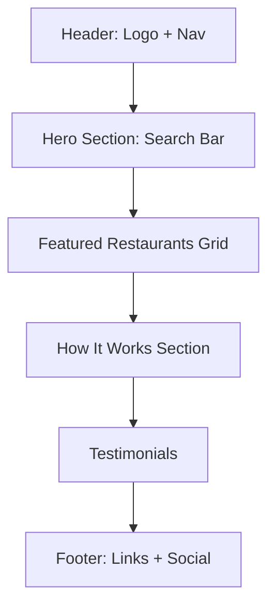

# Phase 4.5: UI/UX Design - Verification Checklist

## Overview

**Phase Objective**: Create comprehensive user experience design including user flows, wireframes, visual design system, and accessibility plan.

**Key Deliverables**:
- `docs/04.5-ui-design/user-flows.md`
- `docs/04.5-ui-design/wireframes.md`
- `docs/04.5-ui-design/design-system.md`
- `docs/04.5-ui-design/accessibility-checklist.md`

**Pass Threshold**: ≥ 85% (17/20 criteria minimum) - **Higher threshold because UI/UX is critical**

**Why UI/UX Matters**:
- First impression determines user retention (38% of users won't return after bad UX)
- Good design reduces support costs (well-designed apps have 50% fewer support tickets)
- Increases conversion (good UX can increase conversion by 200%)

---

## 🎨 USER FLOWS & JOURNEY MAPPING

### Criterion 1: All Primary User Flows Documented

**Description**: Map complete user journeys for all core features.

**How to Verify**:
- [ ] Guest/customer booking flow (end-to-end)
- [ ] Restaurant staff flow (managing bookings)
- [ ] Restaurant admin flow (setup, configuration)
- [ ] Super admin flow (tenant management)
- [ ] Each flow shows: Start → Actions → Decision Points → End State

**Evidence Required**:
Mermaid diagram or detailed step-by-step flow for each:

```
## User Flow: Guest Makes Booking

1. User lands on home page
2. User searches for restaurant (by name, cuisine, location)
3. System shows search results with availability
4. User clicks restaurant → Restaurant detail page
5. User selects: Date, Time, Party size
6. System shows available time slots
7. User selects time slot
8. Decision: Logged in?
   - YES → Go to step 10
   - NO → Show login/signup modal → After auth → Go to step 10
9. (Skipped if logged in)
10. User enters special requests (optional)
11. Decision: Deposit required?
    - YES → Payment screen → User pays → Confirmation
    - NO → Confirmation directly
12. System sends confirmation email/SMS
13. User sees booking confirmation page
14. END STATE: Booking created, user notified

Alternative Flows:
- No availability → Suggest alternative times
- Payment fails → Retry or choose different method
- User cancels mid-flow → Save draft booking
```

**Pass Criteria**: 4/4 primary flows documented with decision points and alternative paths

**Common Failures**:
- ❌ Only happy path (no error cases, no alternatives)
- ❌ Missing decision points (what if user not logged in?)
- ❌ Vague steps ("User books") vs specific ("User selects date, time, party size")

---

### Criterion 2: Edge Cases & Error Flows Mapped

**Description**: What happens when things go wrong?

**How to Verify**:
- [ ] No availability flow (suggest alternatives)
- [ ] Payment failure flow (retry, different method)
- [ ] Double booking prevention (real-time conflict check)
- [ ] Network error flow (offline mode, retry)
- [ ] Form validation errors (clear messaging)

**Evidence Required**:
```
## Edge Case: No Availability for Selected Time

Flow:
1. User selects 7:00 PM on Saturday
2. System checks availability → NONE
3. System shows: "Sorry, no tables available at 7:00 PM"
4. System suggests:
   - Alternative times same day (6:00 PM, 8:30 PM available)
   - Same time next day (7:00 PM Sunday available)
   - Similar restaurants with availability
5. User clicks suggestion → Returns to step 6 of main flow

Wireframe: [Link to wireframe showing "No availability" screen with suggestions]
```

**Pass Criteria**: 4/5 edge cases documented with wireframes

**Common Failures**:
- ❌ "Show error message" (what message? what options?)
- ❌ No wireframe for error states
- ❌ Dead-end errors (no way forward for user)

---

### Criterion 3: Mobile vs Desktop Flows Differentiated

**Description**: Mobile and desktop have different interaction patterns.

**How to Verify**:
- [ ] Mobile-specific patterns noted (bottom navigation, swipe gestures, thumb-friendly buttons)
- [ ] Desktop-specific patterns noted (sidebar navigation, hover states, keyboard shortcuts)
- [ ] Responsive breakpoints defined (mobile: <768px, tablet: 768-1024px, desktop: >1024px)
- [ ] Key differences highlighted (e.g., "Mobile uses bottom sheet for filters, desktop uses sidebar")

**Evidence Required**:
```
## Mobile-Specific Design Patterns

Navigation:
- Mobile: Bottom tab bar (Home, Search, Bookings, Profile)
- Desktop: Top horizontal nav + sidebar

Restaurant Detail Page:
- Mobile: Vertical scroll, sticky "Book Now" button at bottom
- Desktop: Two-column layout (photos left, booking form right)

Date/Time Picker:
- Mobile: Native iOS/Android date picker (better UX on touch)
- Desktop: Custom calendar widget (works better with mouse)

Filters:
- Mobile: Bottom sheet modal (slides up from bottom)
- Desktop: Left sidebar panel (always visible)
```

**Pass Criteria**: 3/4 checkboxes ✅ with specific examples

**Common Failures**:
- ❌ "Mobile and desktop are the same" (rarely true)
- ❌ No mobile-specific optimizations (thumb zones, one-handed use)

---

## 📐 WIREFRAMES & LAYOUTS

### Criterion 4: Wireframes for All Key Pages

**Description**: Visual representation of every major page/screen.

**How to Verify**:
- [ ] Count total pages planned (from Phase 5 component mapping)
- [ ] Wireframe exists for each page (minimum: low-fidelity boxes and labels)
- [ ] Each wireframe shows: Header, main content area, footer, key CTAs
- [ ] Annotations explain functionality

**Evidence Required**:
Minimum wireframes required:

**Public Pages** (4-6 pages):
1. Home page
2. Search results
3. Restaurant detail page
4. Booking confirmation page
5. About/Contact (optional)

**Authenticated User Pages** (5-7 pages):
1. Dashboard (my bookings)
2. Profile settings
3. Booking detail page
4. Booking modification page
5. Payment history (if applicable)

**Restaurant Admin Pages** (8-12 pages):
1. Restaurant dashboard
2. Booking calendar
3. Booking detail/management
4. Restaurant settings (hours, capacity, etc.)
5. Menu management (if applicable)
6. Staff management
7. Analytics/reports
8. Billing

**Super Admin Pages** (4-6 pages):
1. Tenant list
2. Tenant detail/settings
3. System analytics
4. User management (if needed)

**Total**: Minimum 21 wireframes

**Wireframe Format** (can be):
- Mermaid diagrams (text-based, version controllable)
- ASCII art (simple, lightweight)
- Figma exports (high-fidelity, if available)
- Hand-drawn sketches (scanned)

**Example Wireframe (Mermaid)**:


**Example Wireframe (ASCII)**:
```
┌─────────────────────────────────────────┐
│ [Logo]    Home  Restaurants  About  Login │
├─────────────────────────────────────────┤
│                                         │
│      Find Your Perfect Table            │
│  ┌───────────────────────────────────┐  │
│  │ Search restaurants...        [🔍] │  │
│  └───────────────────────────────────┘  │
│                                         │
├─────────────────────────────────────────┤
│  Featured Restaurants                   │
│  ┌──────┐  ┌──────┐  ┌──────┐          │
│  │ [📸]│  │ [📸] │  │ [📸] │          │
│  │ Name │  │ Name │  │ Name │          │
│  │ ⭐4.5│  │ ⭐4.8│  │ ⭐4.3│          │
│  └──────┘  └──────┘  └──────┘          │
└─────────────────────────────────────────┘
```

**Pass Criteria**: 21+ wireframes covering all key pages

**Common Failures**:
- ❌ Only 5-10 wireframes (missing key pages)
- ❌ Wireframes too vague (just "content goes here")
- ❌ No annotations (what do the buttons do?)

---

### Criterion 5: Component Hierarchy Clear

**Description**: Each wireframe shows which components are used and how they nest.

**How to Verify**:
- [ ] Components labeled (e.g., "Header", "SearchBar", "RestaurantCard", "Footer")
- [ ] Nesting shown (e.g., "Page → Container → Grid → RestaurantCard → Image + Title + Rating")
- [ ] Reusable components identified (used across multiple pages)
- [ ] Component props/variants noted (e.g., "RestaurantCard has 2 variants: grid view, list view")

**Evidence Required**:
```
## Home Page Component Hierarchy

HomePage
├─ Header
│   ├─ Logo
│   ├─ Navigation (Desktop)
│   └─ UserMenu (if logged in) | LoginButton (if not)
├─ HeroSection
│   ├─ Heading
│   ├─ SearchBar
│   │   ├─ LocationInput (with autocomplete)
│   │   ├─ DatePicker
│   │   └─ SearchButton
│   └─ BackgroundImage
├─ FeaturedSection
│   ├─ SectionHeading
│   └─ RestaurantGrid
│       └─ RestaurantCard (×6, reusable component)
│           ├─ Image
│           ├─ Title
│           ├─ Rating (StarRating component)
│           ├─ Cuisine (Badge)
│           └─ Price (Badge)
├─ HowItWorksSection
│   ├─ SectionHeading
│   └─ StepGrid
│       └─ StepCard (×3)
│           ├─ Icon
│           ├─ Title
│           └─ Description
└─ Footer
    ├─ LinkColumns (×3)
    ├─ SocialLinks
    └─ Copyright

Reusable Components Identified:
- Header (used on all pages)
- Footer (used on all pages)
- RestaurantCard (used on home, search results, favorites)
- Button (used everywhere)
- SearchBar (used on home, search page header)
```

**Pass Criteria**: Component hierarchy documented for 80%+ of wireframes

**Common Failures**:
- ❌ No component labels (just boxes)
- ❌ Components not identified for reuse

---

### Criterion 6: Interaction States Defined

**Description**: Components have multiple states (default, hover, active, disabled, error, loading).

**How to Verify**:
- [ ] Primary button states shown: default, hover, active, disabled, loading
- [ ] Form input states shown: default, focus, filled, error, disabled
- [ ] Card states shown: default, hover (if clickable)
- [ ] Loading states defined (skeleton screens, spinners, progress bars)

**Evidence Required**:
```
## Button Component States

Primary Button:
- Default: Blue background (#007AFF), white text, no shadow
- Hover: Darker blue (#0056B3), white text, subtle shadow
- Active/Pressed: Even darker blue (#004085), white text, inset shadow
- Disabled: Gray background (#C4C4C4), gray text (#757575), no interaction
- Loading: Blue background, white spinner, "Processing..." text, no interaction

Secondary Button:
- Default: White background, blue border, blue text
- Hover: Light blue background (#E6F2FF), blue border, blue text
- [... etc ...]

## Form Input States

Text Input:
- Default: White background, gray border (#D1D5DB), gray placeholder
- Focus: White background, blue border (#007AFF), blue outline
- Filled: White background, dark gray border, black text
- Error: White background, red border (#DC2626), red error text below
- Disabled: Light gray background (#F3F4F6), gray border, gray text, no interaction

## Loading States

Page Loading:
- Skeleton Screen: Gray placeholder boxes animating (shimmer effect)
- Used for: Restaurant list, booking calendar

Action Loading:
- Spinner: Small circular spinner next to text
- Used for: "Creating booking..." button

Progress Loading:
- Progress Bar: 0-100% with steps
- Used for: Multi-step booking form (Step 1/4, Step 2/4, ...)
```

**Pass Criteria**: States defined for primary interactive components (buttons, inputs, cards)

**Common Failures**:
- ❌ Only default state (no hover, error, loading)
- ❌ Inconsistent states across components

---

## 🎨 VISUAL DESIGN SYSTEM

### Criterion 7: Color Palette Defined

**Description**: Complete color system with semantic meaning.

**How to Verify**:
- [ ] Primary color(s) defined with hex codes
- [ ] Secondary color(s) defined
- [ ] Neutral palette (grays) defined (3-7 shades)
- [ ] Semantic colors defined: success (green), error (red), warning (yellow), info (blue)
- [ ] Accessibility checked: All text/background combinations meet WCAG 2.1 AA (4.5:1 contrast for normal text)

**Evidence Required**:
```
## Color System

### Brand Colors
- Primary: #007AFF (Blue) - Main CTAs, links, active states
- Primary Hover: #0056B3
- Primary Pressed: #004085
- Secondary: #34C759 (Green) - Success, confirmations
- Accent: #FF9500 (Orange) - Highlights, promotions

### Neutral Palette
- Gray 50: #F9FAFB (Backgrounds, subtle sections)
- Gray 100: #F3F4F6 (Disabled backgrounds)
- Gray 200: #E5E7EB (Borders, dividers)
- Gray 300: #D1D5DB (Input borders)
- Gray 400: #9CA3AF (Placeholder text)
- Gray 500: #6B7280 (Secondary text)
- Gray 600: #4B5563 (Body text)
- Gray 700: #374151 (Headings)
- Gray 800: #1F2937
- Gray 900: #111827 (Primary text, dark mode background)

### Semantic Colors
- Success: #10B981 (Booking confirmed, payment success)
- Error: #EF4444 (Form errors, failed actions)
- Warning: #F59E0B (Warnings, deposit required)
- Info: #3B82F6 (Info messages, tips)

### Accessibility Check
Primary (#007AFF) on White (#FFFFFF):
- Contrast Ratio: 4.6:1 ✅ (Passes WCAG AA for large text, AAA for large bold)
- Note: For small text, use darker variant (#0056B3) → 7.2:1 ✅

Error (#EF4444) on White:
- Contrast Ratio: 4.5:1 ✅ (Passes WCAG AA)

Gray 600 (#4B5563) on White (body text):
- Contrast Ratio: 8.9:1 ✅ (Passes WCAG AAA)
```

**Pass Criteria**: All 5 checkboxes ✅ + accessibility verified

**Tools for Verification**:
- WebAIM Contrast Checker: https://webaim.org/resources/contrastchecker/
- Coolors Contrast Checker: https://coolors.co/contrast-checker

**Common Failures**:
- ❌ Insufficient contrast (pretty but unreadable)
- ❌ Too many colors (confusing, inconsistent)
- ❌ No semantic meaning (when to use which color?)

---

### Criterion 8: Typography System Defined

**Description**: Font families, sizes, weights, and hierarchy.

**How to Verify**:
- [ ] Font families chosen (heading font, body font)
- [ ] Type scale defined (6-10 sizes minimum)
- [ ] Font weights specified (normal, medium, semibold, bold)
- [ ] Line heights defined
- [ ] Usage guidelines (when to use which style)

**Evidence Required**:
```
## Typography System

### Font Families
- Headings: 'Playfair Display', serif (elegant, upscale feel)
- Body: 'Inter', sans-serif (readable, modern)
- Monospace: 'Fira Code', monospace (for booking codes, if needed)

### Type Scale
- Display: 48px / 3rem (Hero headings, rare)
- H1: 36px / 2.25rem (Page titles)
- H2: 30px / 1.875rem (Section headings)
- H3: 24px / 1.5rem (Card titles)
- H4: 20px / 1.25rem (Subsection headings)
- Body Large: 18px / 1.125rem (Intro paragraphs)
- Body: 16px / 1rem (Default body text)
- Body Small: 14px / 0.875rem (Captions, labels)
- Caption: 12px / 0.75rem (Timestamps, meta info)

### Font Weights
- Regular (400): Body text
- Medium (500): Emphasized text
- Semibold (600): Buttons, strong emphasis
- Bold (700): Headings

### Line Heights
- Headings: 1.2 (tight for impact)
- Body: 1.6 (comfortable reading)
- Captions: 1.4 (compact for small text)

### Usage Guidelines

Page Title:
- Font: Playfair Display
- Size: H1 (36px)
- Weight: Bold (700)
- Color: Gray 900

Section Heading:
- Font: Playfair Display
- Size: H2 (30px)
- Weight: Semibold (600)
- Color: Gray 900

Body Text:
- Font: Inter
- Size: Body (16px)
- Weight: Regular (400)
- Color: Gray 600
- Line Height: 1.6

Button Text:
- Font: Inter
- Size: Body (16px)
- Weight: Semibold (600)
- Color: White (on primary button) / Primary (on secondary button)
```

**Pass Criteria**: All 5 checkboxes ✅ with usage guidelines

**Common Failures**:
- ❌ Too many font sizes (inconsistent, chaotic)
- ❌ No line height defined (text too cramped)
- ❌ Mixing too many font families (>3 is usually too many)

---

### Criterion 9: Spacing System Defined

**Description**: Consistent spacing/padding/margin scale.

**How to Verify**:
- [ ] Spacing scale defined (base unit: 4px or 8px common)
- [ ] 8-12 spacing values (e.g., 4px, 8px, 12px, 16px, 24px, 32px, 48px, 64px)
- [ ] Usage guidelines (when to use which spacing)
- [ ] Component-specific spacing noted (e.g., "Cards have 16px internal padding")

**Evidence Required**:
```
## Spacing System

Base Unit: 4px (all spacing is multiple of 4 for visual consistency)

### Spacing Scale
- xs: 4px (0.25rem) - Tight spacing, icon gaps
- sm: 8px (0.5rem) - Small gaps, compact layouts
- md: 12px (0.75rem) - Default spacing
- base: 16px (1rem) - Standard spacing (most common)
- lg: 24px (1.5rem) - Section spacing
- xl: 32px (2rem) - Large section spacing
- 2xl: 48px (3rem) - Major section breaks
- 3xl: 64px (4rem) - Hero spacing
- 4xl: 96px (6rem) - Rarely used, major dividers

### Usage Guidelines

Component Internal Padding:
- Button: 12px (vertical) × 24px (horizontal)
- Input Field: 12px (vertical) × 16px (horizontal)
- Card: 16px or 24px (depending on card size)
- Modal: 24px or 32px

Layout Spacing:
- Between form fields: 16px
- Between sections: 48px (desktop) / 32px (mobile)
- Page margins: 24px (mobile) / 48px (tablet) / 96px (desktop)

Grid Gaps:
- Card grid: 24px
- Icon grid: 16px
- List items: 12px

### Example: Restaurant Card Spacing
┌──────────────────────┐
│ [Image]              │ ← No padding (full-bleed image)
├──────────────────────┤
│  Title           [16px padding all sides]
│
│  Description
│
│  ⭐4.5 · $$
│                      │
│  [Book Now Button]   │
└──────────────────────┘
   ↑                ↑
  16px            16px
```

**Pass Criteria**: Spacing scale + usage guidelines for components

**Common Failures**:
- ❌ Random spacing values (13px, 17px, 22px) - inconsistent
- ❌ No system (designers guess spacing every time)

---

### Criterion 10: Component Styling Defined

**Description**: Visual style for all reusable UI components.

**How to Verify**:
- [ ] Button styles (primary, secondary, tertiary, ghost, danger)
- [ ] Input styles (text, select, checkbox, radio, toggle)
- [ ] Card styles (default, outlined, elevated)
- [ ] Badge/chip styles (status badges, tags)
- [ ] At least 15-20 component styles defined

**Evidence Required**:
```
## Component Styles

### Buttons (5 variants)

Primary Button:
- Background: Primary color (#007AFF)
- Text: White
- Border: None
- Border Radius: 8px
- Padding: 12px × 24px
- Font: Inter, 16px, Semibold
- Shadow: 0 1px 2px rgba(0,0,0,0.05)
- Hover: Darker blue, shadow increases

Secondary Button:
- Background: White
- Text: Primary color
- Border: 1px solid Primary color
- [... other styles ...]

Ghost Button:
- Background: Transparent
- Text: Primary color
- Border: None
- Hover: Light gray background

Danger Button:
- Background: Error color (#EF4444)
- Text: White
- [... other styles ...]

### Inputs (4 types)

Text Input:
- Background: White
- Border: 1px solid Gray 300
- Border Radius: 6px
- Padding: 12px × 16px
- Font: Inter, 16px
- Placeholder: Gray 400
- Focus: Blue border, blue outline

Select Dropdown:
- [Similar to text input]
- Icon: Chevron down (Gray 400)

Checkbox:
- Size: 20px × 20px
- Border: 2px solid Gray 300
- Border Radius: 4px
- Checked: Primary color background, white checkmark

Toggle Switch:
- Width: 44px, Height: 24px
- Background: Gray 300 (off), Primary color (on)
- Knob: White, 20px diameter
- Transition: 0.2s ease

### Cards (3 variants)

Default Card:
- Background: White
- Border: 1px solid Gray 200
- Border Radius: 12px
- Padding: 16px
- Shadow: None
- Hover: Subtle shadow (0 4px 6px rgba(0,0,0,0.1))

Elevated Card:
- Background: White
- Border: None
- Border Radius: 12px
- Padding: 24px
- Shadow: 0 4px 12px rgba(0,0,0,0.1)
- Hover: Shadow increases

Outlined Card:
- Background: Transparent
- Border: 2px solid Primary color
- [... other styles ...]

### Badges (4 variants)

Status Badge - Success:
- Background: Light green (#D1FAE5)
- Text: Dark green (#065F46)
- Font: Inter, 12px, Medium
- Padding: 4px × 8px
- Border Radius: 12px (pill shape)

Status Badge - Error:
- Background: Light red (#FEE2E2)
- Text: Dark red (#991B1B)
- [... other styles ...]

Tag Badge:
- Background: Gray 100
- Text: Gray 700
- [... other styles ...]

### [Define 12+ more components: Modal, Toast, Tooltip, Dropdown Menu, Tabs, Accordion, etc.]
```

**Pass Criteria**: 15+ component styles fully defined

**Common Failures**:
- ❌ Only 5-6 components (missing many needed)
- ❌ Vague descriptions ("nice rounded button")
- ❌ No variants (every button looks the same)

---

## ♿ ACCESSIBILITY & USABILITY

### Criterion 11: Accessibility Guidelines Documented

**Description**: WCAG 2.1 Level AA compliance plan.

**How to Verify**:
- [ ] Color contrast verified (4.5:1 for text, 3:1 for UI components)
- [ ] Keyboard navigation plan (all interactive elements accessible via Tab, Enter, Space, Escape)
- [ ] Screen reader considerations (ARIA labels, semantic HTML)
- [ ] Focus indicators defined (visible outline on all interactive elements)
- [ ] Alt text strategy (all images have meaningful alt text)

**Evidence Required**:
```
## Accessibility Plan (WCAG 2.1 AA)

### 1. Color Contrast (WCAG 1.4.3)
✅ All text meets 4.5:1 minimum (body text: Gray 600 on White = 8.9:1)
✅ Large text (18px+) meets 3:1 minimum
✅ UI components meet 3:1 (buttons, borders)
⚠️ Error icons use red + icon shape (not just color to convey meaning)

### 2. Keyboard Navigation (WCAG 2.1.1)
- Tab order: Logical left-to-right, top-to-bottom
- Enter: Activates buttons, links
- Space: Activates buttons, checks checkboxes
- Escape: Closes modals, dropdowns
- Arrow keys: Navigate within menus, date pickers
- Tab traps: Modals trap focus (can't Tab outside until closed)

Skip Links:
- "Skip to main content" link (visible on focus)
- Allows keyboard users to bypass repetitive navigation

### 3. Screen Reader Support (WCAG 4.1.2)
Semantic HTML:
- Use <button> not <div onclick>
- Use <nav> for navigation
- Use <main> for main content
- Use <header>, <footer> correctly

ARIA Labels:
- Icon-only buttons: aria-label="Close modal"
- Search input: aria-label="Search restaurants"
- Form errors: aria-describedby links input to error message
- Loading states: aria-live="polite" announces "Loading results"

### 4. Focus Indicators (WCAG 2.4.7)
- All interactive elements have visible focus
- Focus outline: 2px solid Primary color, 2px offset
- Never remove focus outlines (CSS: outline: none ❌)
- Focus visible on: Buttons, Links, Inputs, Cards (if clickable)

### 5. Alt Text Strategy (WCAG 1.1.1)
- Decorative images: alt="" (empty, screen reader skips)
- Meaningful images: alt="[Description]"
  - Example: alt="Cozy Italian restaurant interior with warm lighting"
- Functional images (icons): alt describes function
  - Example: alt="Close" (not alt="X icon")

### 6. Form Accessibility
- Labels: Every input has a <label> (not just placeholder)
- Error messages: Displayed inline, associated with input via aria-describedby
- Required fields: Marked with * and aria-required="true"
- Input types: Use correct HTML5 types (email, tel, url, date)

### 7. Additional Considerations
- Text resizable up to 200% without breaking layout (WCAG 1.4.4)
- No auto-playing audio (WCAG 1.4.2)
- Timing adjustable for actions like "Confirm booking in 10 minutes" (WCAG 2.2.1)
- Animations respect prefers-reduced-motion (WCAG 2.3.3)
```

**Pass Criteria**: All 5 checkboxes ✅ + comprehensive plan

**Common Failures**:
- ❌ "We'll make it accessible" (too vague)
- ❌ Color-only indicators (red text for errors, but no icon)
- ❌ Missing keyboard support
- ❌ No alt text defined

---

### Criterion 12: Mobile Usability Optimized

**Description**: Mobile-specific design considerations.

**How to Verify**:
- [ ] Touch targets ≥ 44×44px (Apple HIG) or ≥ 48×48px (Android Material Design)
- [ ] Thumb-friendly zones (important actions at bottom of screen)
- [ ] One-handed use considered (primary actions reachable with thumb)
- [ ] No hover-dependent interactions (mobile has no hover)
- [ ] Text readable without zooming (min 16px for body text)

**Evidence Required**:
```
## Mobile Usability Guidelines

### Touch Targets
- Minimum size: 48×48px (Android Material Design guideline)
- Apple recommends: 44×44px minimum
- Our standard: 48×48px to satisfy both
- Spacing between targets: Minimum 8px gap

Examples:
- Button height: 48px (meets minimum)
- Icon-only buttons: 48×48px (not 24×24px)
- List items: 56px height (comfortable tapping)
- Bottom nav icons: 56×56px (generous target)

### Thumb Zones (for right-handed users, majority)

[Diagram of phone screen divided into zones]
┌─────────────┐
│  Hard       │ ← Top of screen (hard to reach)
│             │
│   Natural   │ ← Middle (easy to reach)
│             │
│    Easy     │ ← Bottom (easiest to reach)
└─────────────┘

Thumb-Friendly Placement:
- Primary CTA: Bottom of screen (easy zone)
- Navigation: Bottom tab bar (easy zone)
- Secondary actions: Middle or top
- Destructive actions: Top (harder to accidentally tap)

Example - Booking Flow:
- "Book Now" button: Bottom, sticky, always visible
- "Back" button: Top left (common pattern, ok to be less accessible)
- Form fields: Middle (natural zone)

### One-Handed Use
- Critical actions within thumb reach (green zone)
- Modals have close button at top (swipe down to close as alternative)
- Bottom sheets preferred over center modals (easier to dismiss)

### No Hover States on Mobile
- Hover styles only applied on @media (hover: hover)
- Mobile uses active/pressed states instead
- Card tap provides visual feedback (slight scale or background change)

### Text Legibility
- Minimum body text: 16px (never smaller on mobile)
- Headings: 20px+ (need to be readable at arm's length)
- Line height: 1.5-1.6 (more generous than desktop)
- Line length: 50-60 characters max (easier to read on small screens)
```

**Pass Criteria**: All 5 checkboxes ✅

**Common Failures**:
- ❌ Tiny touch targets (32×32px buttons)
- ❌ Important actions at top of screen (hard to reach)
- ❌ Hover-dependent UI (tooltips only on hover)
- ❌ Text too small (12px body text)

---

## 🔄 INTERACTION DESIGN

### Criterion 13: Animations & Transitions Defined

**Description**: Motion design for delightful UX.

**How to Verify**:
- [ ] Transition durations defined (fast: 150ms, normal: 250ms, slow: 400ms)
- [ ] Easing functions specified (ease-in-out, ease-out, cubic-bezier)
- [ ] Animated interactions listed (button clicks, page transitions, modal open/close)
- [ ] Performance considered (avoid animating width/height, use transform)
- [ ] Respects prefers-reduced-motion for accessibility

**Evidence Required**:
```
## Animation & Motion Design

### Duration Scale
- Instant: 0ms (no animation, immediate feedback)
- Fast: 150ms (micro-interactions, hover states)
- Normal: 250ms (default for most animations)
- Slow: 400ms (page transitions, complex animations)

### Easing Functions
- ease-out: Fast start, slow end (good for elements entering, default)
- ease-in: Slow start, fast end (good for elements exiting)
- ease-in-out: Slow start and end (smooth, feels natural)
- Custom: cubic-bezier(0.4, 0.0, 0.2, 1) (Material Design standard)

### Animated Interactions

Button Click:
- Property: transform (scale)
- Duration: 150ms
- Easing: ease-out
- Effect: Scale down to 0.95 on click, then back to 1

Page Transition:
- Property: opacity, transform (translateX)
- Duration: 250ms
- Easing: ease-out
- Effect: New page fades in and slides from right (0 → 100%)

Modal Open:
- Property: opacity, transform (scale)
- Duration: 250ms
- Easing: ease-out
- Effect: Modal fades in and scales from 0.9 to 1 (feels like it's popping up)

Modal Close:
- Property: opacity, transform (scale)
- Duration: 200ms
- Easing: ease-in
- Effect: Modal fades out and scales to 0.95 (reverse of open, slightly faster)

Skeleton Loading:
- Property: background-position (shimmer effect)
- Duration: 1500ms
- Easing: linear
- Effect: Continuous left-to-right shimmer

### Performance Considerations
Animate:
- ✅ transform (translate, scale, rotate)
- ✅ opacity
- ✅ filter (if minimal)

Avoid Animating:
- ❌ width, height (causes reflow, janky)
- ❌ top, left (use transform: translate instead)
- ❌ padding, margin (causes reflow)

### Accessibility: prefers-reduced-motion
@media (prefers-reduced-motion: reduce) {
  * {
    animation-duration: 0.01ms !important;
    transition-duration: 0.01ms !important;
  }
}
Users with vestibular disorders can disable animations.
```

**Pass Criteria**: All 5 checkboxes ✅

**Common Failures**:
- ❌ No durations defined (guessing every time)
- ❌ Animating width/height (poor performance)
- ❌ Ignoring prefers-reduced-motion

---

### Criterion 14: Feedback & Affordances

**Description**: Users should know what they can interact with and get feedback when they do.

**How to Verify**:
- [ ] Clickable elements look clickable (buttons have button styles, links are underlined or colored)
- [ ] Cursor changes on hover (pointer for clickable, text for text, grab for draggable)
- [ ] Loading states for all async actions (spinners, progress bars, skeleton screens)
- [ ] Success/error feedback after actions (toasts, inline messages)
- [ ] Disabled states clearly communicated (grayed out, cursor: not-allowed)

**Evidence Required**:
```
## Feedback & Affordances

### Visual Affordances

Buttons:
- Look like buttons (rounded, filled or outlined, shadows)
- Cursor: pointer
- Hover: Background changes, shadow increases
- Active: Scales down slightly
→ User knows "this is clickable"

Links:
- Blue color (or primary color)
- Underline (on hover if not always)
- Cursor: pointer
→ User knows "this will navigate somewhere"

Input Fields:
- Border (distinct from read-only text)
- Placeholder text (light gray)
- Cursor: text (changes to I-beam over input)
- Focus: Border color changes, outline appears
→ User knows "I can type here"

Disabled Elements:
- Grayed out (opacity: 0.5 or Gray 300 background)
- Cursor: not-allowed
- No hover effects
- Tooltip explains why disabled (optional)
→ User knows "this isn't available right now"

### Loading States

After Button Click:
- Button text changes to "Processing..."
- Spinner appears next to text
- Button disabled during process
- Duration: Immediate (feels responsive)

After Form Submit:
- Full-page loading overlay (for complex operations)
- OR inline skeleton screen (for fetching data)
- Duration: Shows immediately if >100ms

Page Load:
- Skeleton screens for content (gray placeholder boxes)
- Shimmer animation (feels active, not frozen)
- Duration: Shows while fetching data

### Success/Error Feedback

Success Toast (after booking created):
- Green background (#10B981)
- White text
- Checkmark icon
- Message: "Booking confirmed! Check your email for details."
- Duration: 5 seconds, auto-dismiss
- Position: Top-right corner (desktop) / Top center (mobile)

Error Toast (after payment fails):
- Red background (#EF4444)
- White text
- X icon
- Message: "Payment failed. Please try a different card or payment method."
- Duration: 8 seconds (longer for errors, user needs to read)
- Position: Same as success

Inline Success (after form field validation):
- Green checkmark icon next to input
- Green border
- Message: "Looks good!" (subtle)

Inline Error (after form field validation):
- Red X icon next to input
- Red border
- Message: "Please enter a valid email address" (specific, actionable)
```

**Pass Criteria**: All 5 checkboxes ✅

**Common Failures**:
- ❌ No loading states (user thinks app is frozen)
- ❌ Silent failures (action fails, no feedback)
- ❌ Vague errors ("Something went wrong" - what?)

---

## 📱 RESPONSIVE DESIGN

### Criterion 15: Breakpoints & Layouts Defined

**Description**: How does the design adapt to different screen sizes?

**How to Verify**:
- [ ] Breakpoints defined (common: mobile <768px, tablet 768-1024px, desktop >1024px)
- [ ] Layout changes per breakpoint documented (e.g., "3-column grid on desktop becomes 1-column on mobile")
- [ ] Component behavior at each breakpoint (e.g., "Sidebar collapses to hamburger menu on mobile")
- [ ] Typography scaling (font sizes adjust for mobile vs desktop)

**Evidence Required**:
```
## Responsive Breakpoints

### Breakpoints
- Mobile: 0-767px (single column, bottom nav)
- Tablet: 768-1023px (2 columns, hybrid nav)
- Desktop: 1024-1439px (3 columns, sidebar nav)
- Large Desktop: 1440px+ (wider max-width, more whitespace)

### Layout Changes

Home Page:
- Desktop (>1024px):
  - Header: Horizontal nav, logo left, menu center, user right
  - Hero: Full-width background, search bar centered
  - Featured Restaurants: 3-column grid
  - Footer: 4-column layout

- Tablet (768-1023px):
  - Header: Same as desktop
  - Featured Restaurants: 2-column grid
  - Footer: 2-column layout

- Mobile (<768px):
  - Header: Logo left, hamburger right, no menu (hidden in drawer)
  - Hero: Full-width, search bar full-width
  - Featured Restaurants: 1-column list (vertical stack)
  - Footer: 1-column, stacked links
  - Bottom Nav: Home, Search, Bookings, Profile (sticky)

### Component Behavior

Navigation:
- Desktop: Horizontal top nav, always visible
- Tablet: Same as desktop
- Mobile: Hamburger menu → Slide-out drawer

Restaurant Card:
- Desktop: Horizontal layout (image left, content right)
- Mobile: Vertical layout (image top, content below)

Booking Form:
- Desktop: Sticky sidebar (stays in view while scrolling restaurant details)
- Mobile: Full-width, sticky "Book Now" button at bottom (expands to form when tapped)

### Typography Scaling

Headings (Desktop → Mobile):
- H1: 36px → 28px
- H2: 30px → 24px
- H3: 24px → 20px

Body Text:
- Desktop: 16px (comfortable reading at distance)
- Mobile: 16px (same, minimum for legibility on small screen)

Line Length:
- Desktop: Max 65-75 characters (comfortable reading)
- Mobile: Full-width (screen is narrow anyway, ~35-45 characters)
```

**Pass Criteria**: All 4 checkboxes ✅

**Common Failures**:
- ❌ Same layout on all screens (doesn't adapt)
- ❌ Text too small on mobile
- ❌ Horizontal scrolling on mobile (layout overflows)

---

## 📄 DOCUMENTATION QUALITY

### Criterion 16: Design Decisions Documented

**Description**: WHY did you make these design choices?

**How to Verify**:
- [ ] Rationale for color choices (e.g., "Blue conveys trust, common in food/hospitality")
- [ ] Rationale for typography (e.g., "Playfair Display gives upscale feel, targets premium segment")
- [ ] Rationale for layout patterns (e.g., "Bottom nav on mobile because 78% of users are mobile")
- [ ] Rationale for accessibility choices (e.g., "WCAG AA required for government contracts")
- [ ] Trade-offs documented (e.g., "Chose simple date picker over complex calendar due to MVP timeline")

**Evidence Required**:
```
## Design Decisions & Rationale

### Color Palette
Choice: Blue (#007AFF) as primary color

Rationale:
- Blue conveys trust and reliability (critical for booking/payment)
- Common in food/hospitality industry (OpenTable, Resy use blue)
- Accessible (good contrast with white background)
- Culturally neutral (works in Indonesia and internationally)

Alternative Considered: Orange (vibrant, appetite-inducing)
Why Not Chosen: Too similar to competitor Eatigo (orange brand), less professional feel

### Typography
Choice: Playfair Display (headings) + Inter (body)

Rationale:
- Playfair: Elegant serif, conveys upscale dining experience
- Inter: Clean sans-serif, excellent readability on screens
- Pairing: Classic serif + modern sans-serif is proven combo
- Performance: Google Fonts (fast CDN, subset loading)

Alternative Considered: Lora + Roboto
Why Not Chosen: Too similar to many other apps, less distinctive

### Navigation Pattern
Choice: Bottom tab bar on mobile

Rationale:
- 78% of users are mobile (Phase 1 research)
- Bottom nav is thumb-friendly (easy to reach)
- Industry standard (OpenTable, Resy use bottom nav)
- Allows permanent visibility of key actions

Alternative Considered: Hamburger menu only
Why Not Chosen: Requires extra tap, less discoverable, hides key features

### Date Picker
Choice: Simple date/time dropdowns for MVP

Rationale:
- MVP timeline (2 weeks faster than custom calendar)
- Works well for near-term bookings (80% book within 7 days)
- Accessible (native HTML inputs work with screen readers)

Alternative Considered: Full calendar grid with availability heatmap
Deferred to Phase 2: Cool feature, but not critical for MVP

### Card Style
Choice: Elevated cards (with shadow)

Rationale:
- Creates visual hierarchy (cards pop off background)
- Common pattern (users familiar)
- Works well with image-heavy content (restaurant photos)

Alternative Considered: Outlined cards (border only)
Why Not Chosen: Too flat, less premium feel
```

**Pass Criteria**: 5/5 checkboxes ✅ with alternatives considered

**Common Failures**:
- ❌ "We chose blue because it looks nice" (no reasoning)
- ❌ No alternatives considered
- ❌ Can't explain trade-offs

---

### Criterion 17: Design System Comprehensive

**Description**: Design system is complete and reusable.

**How to Verify**:
- [ ] All colors, fonts, spacing defined (no ad-hoc values)
- [ ] Component library maps to design tokens (e.g., "Primary Button uses color.primary")
- [ ] Design system documented in single source of truth (`design-system.md`)
- [ ] Can be translated to `siso-site-config.yaml` (for multi-tenant theming)
- [ ] Examples provided for common patterns (forms, cards, modals)

**Evidence Required**:
Check that `design-system.md` includes:

```
## Design System Overview

This design system defines all visual styles, components, and patterns used throughout the application. It serves as the single source of truth for designers and developers.

### Design Tokens

Colors: [All defined as variables]
- color.primary: #007AFF
- color.secondary: #34C759
- color.gray.50: #F9FAFB
- [... all colors ...]

Typography: [All defined as variables]
- font.heading: 'Playfair Display'
- font.body: 'Inter'
- fontSize.h1: 36px
- [... all sizes ...]

Spacing: [All defined as variables]
- space.xs: 4px
- space.sm: 8px
- [... all spacing ...]

Shadows: [All defined as variables]
- shadow.sm: 0 1px 2px rgba(0,0,0,0.05)
- shadow.md: 0 4px 6px rgba(0,0,0,0.1)
- [... all shadows ...]

Border Radius: [All defined]
- radius.sm: 4px
- radius.md: 8px
- radius.lg: 12px
- radius.full: 9999px (pill shape)

### Component Library
- Buttons (5 variants)
- Inputs (4 types)
- Cards (3 variants)
- Badges (4 variants)
- Modals
- Toasts
- Tooltips
- [... 15+ components total ...]

Each component references tokens:
Example:
Primary Button {
  background: color.primary
  padding: space.md × space.lg
  borderRadius: radius.md
  fontSize: fontSize.body
}

### Common Patterns

Form Pattern:
[Wireframe + code snippet showing how to build a form using design system]

Card Grid Pattern:
[Wireframe + code snippet]

Modal Pattern:
[Wireframe + code snippet]
```

**Pass Criteria**: All 5 checkboxes ✅

**Translation to `siso-site-config.yaml`**:
```yaml
theme:
  colors:
    primary: "#007AFF"
    secondary: "#34C759"
    gray:
      50: "#F9FAFB"
      # ... all grays ...
    semantic:
      success: "#10B981"
      error: "#EF4444"
  typography:
    fonts:
      heading: "'Playfair Display', serif"
      body: "'Inter', sans-serif"
    sizes:
      h1: "36px"
      # ... all sizes ...
  spacing:
    xs: "4px"
    # ... all spacing ...
  borderRadius:
    md: "8px"
    # ...
```

**Common Failures**:
- ❌ Design system scattered across multiple docs
- ❌ Components use hard-coded values (not tokens)
- ❌ Can't translate to config file

---

## 🎯 USABILITY & UX PRINCIPLES

### Criterion 18: User Flow Optimization

**Description**: Minimize steps to complete core actions.

**How to Verify**:
- [ ] Guest booking flow: ≤ 5 steps (industry best practice)
- [ ] Returning user booking: ≤ 3 steps (already logged in, payment saved)
- [ ] Restaurant admin accept/reject booking: ≤ 2 clicks
- [ ] No unnecessary steps (asking for info we already have)

**Evidence Required**:
```
## Core Flow Optimization

### Guest Booking Flow (≤ 5 steps)
1. Search restaurant (or browse → select restaurant)
2. Select date, time, party size
3. Login/signup (or continue as guest if supported)
4. Enter special requests (optional), payment (if deposit required)
5. Confirmation

Actual: 5 steps (best case) ✅
Competitor comparison:
- OpenTable: 6 steps (extra: enter phone number even if logged in)
- Chope: 5 steps (same as us)
Our approach: Match best, not worse

### Returning User Booking (≤ 3 steps)
1. Select date, time, party size (autofilled from last booking)
2. Review & confirm (payment method saved)
3. Confirmation

Actual: 3 steps ✅
Optimization: Pre-fill party size from user's last booking

### Restaurant Admin: Accept Booking (≤ 2 clicks)
1. Click booking in list
2. Click "Accept" button → Confirmed

Actual: 2 clicks ✅

Alternative (faster): Click "Accept" directly from list (no detail view)
Actual: 1 click (implement if feasible)

### Unnecessary Steps Removed
❌ Don't ask for: Phone number if already in user profile
❌ Don't ask for: Email confirmation if user logged in (we have their email)
✅ Do ask for: Special requests (optional but valuable to restaurant)
✅ Do ask for: Payment if deposit required (necessary)
```

**Pass Criteria**: All 4 checkboxes ✅

**Common Failures**:
- ❌ Too many steps (7-10 steps to book)
- ❌ Asking for redundant info
- ❌ No optimization for returning users

---

### Criterion 19: Error Prevention & Recovery

**Description**: Prevent errors where possible, make recovery easy.

**How to Verify**:
- [ ] Form validation (inline, real-time feedback before submit)
- [ ] Confirmation dialogs for destructive actions (e.g., "Cancel booking? This cannot be undone.")
- [ ] Default values provided (e.g., "Party size defaults to 2")
- [ ] Error messages are actionable (tell user HOW to fix, not just WHAT is wrong)

**Evidence Required**:
```
## Error Prevention

### Form Validation
- Real-time validation (as user types, not just on submit)
- Example: Email field turns green with checkmark when valid email entered
- Example: Phone field shows error "Please enter 10-12 digits" if too short
- Submit button disabled until all required fields valid

### Confirmation Dialogs
Destructive Action: Cancel Booking
Modal appears:
"Cancel Booking?
You are about to cancel your booking for [Restaurant Name] on [Date] at [Time].
This action cannot be undone, and any deposit will be refunded in 5-7 business days.
[Cancel Booking] [Keep Booking]"

Why: Prevents accidental cancellations

Non-Destructive Action: Edit Booking
No confirmation needed, changes are reversible

### Default Values
- Party size: Defaults to 2 (most common)
- Date: Defaults to tomorrow (today often fully booked)
- Time: Defaults to 7:00 PM (peak dinner time)
- Duration: Defaults to 2 hours (standard)

Why: Reduces cognitive load, faster booking

### Actionable Error Messages

❌ Bad: "Invalid input"
✅ Good: "Please enter a valid email address (e.g., name@example.com)"

❌ Bad: "Error 422"
✅ Good: "This time slot is no longer available. Please choose a different time."

❌ Bad: "Payment failed"
✅ Good: "Payment failed. Please check your card number and try again, or use a different payment method."

Each error message:
- Explains WHAT went wrong
- Explains HOW to fix it
- Provides example or alternative
```

**Pass Criteria**: All 4 checkboxes ✅

**Common Failures**:
- ❌ Validation only on submit (user fills 10 fields, submits, all turn red)
- ❌ No confirmation for destructive actions
- ❌ Cryptic error messages ("Error 500")

---

### Criterion 20: Consistency & Familiarity

**Description**: UI follows established patterns, internally consistent.

**How to Verify**:
- [ ] Design patterns consistent across app (e.g., all modals look the same, all buttons behave the same)
- [ ] Familiar patterns used (e.g., hamburger icon for menu, magnifying glass for search)
- [ ] Terminology consistent (e.g., don't call it "Reservation" in one place and "Booking" in another)
- [ ] Icons match common conventions (checkmark = success, X = close/error)

**Evidence Required**:
```
## Consistency & Familiarity

### Internal Consistency

Button Behavior:
- All primary buttons: Blue, rounded, hover shadow
- All secondary buttons: White background, blue border
- Consistent across all pages (no random green buttons)

Modal Behavior:
- All modals: Centered, fade-in animation, dark overlay
- All modals close with: X button (top-right) OR Escape key OR click outside
- Consistent positioning, animation, dismissal

Form Patterns:
- All forms: Labels above inputs, error messages below, required fields marked with *
- Submit button always at bottom-right (or centered on mobile)

### Familiar Patterns

Icons:
- Hamburger (≡): Menu
- Magnifying glass (🔍): Search
- Calendar (📅): Date picker
- Clock (🕐): Time picker
- Checkmark (✓): Success, completed
- X (✕): Close, error
- Pencil (✏️): Edit
- Trash (🗑️): Delete
- Bell (🔔): Notifications
- User (👤): Profile

UI Patterns:
- Search bar: Magnifying glass icon on left, placeholder "Search...", clear button (X) on right when text entered
- Card hover: Subtle shadow increase (user expects cards to be clickable)
- Tab navigation: Active tab has underline or background highlight

### Terminology Consistency

Term Used Throughout App: "Booking" (not "Reservation")
- Booking list, Create booking, Cancel booking, Booking details
- Never: "Make a reservation", "Your reservations"

Other Terms:
- "Restaurant" (not "Venue" or "Establishment")
- "Party size" (not "Number of guests" or "Headcount")
- "Time slot" (not "Seating time" or "Booking window")

### Convention Following

Form Conventions:
- Name field before email field (expected order)
- Required fields marked with * (common)
- Submit buttons say "Submit", "Confirm", "Book Now" (not "Go" or "OK")

Navigation Conventions:
- Logo in top-left (clickable, goes to home)
- User menu in top-right
- Primary nav in header (desktop) or bottom bar (mobile)
- Breadcrumbs (if used) below header

Error Conventions:
- Red = error
- Green = success
- Yellow = warning
- Blue = info
```

**Pass Criteria**: All 4 checkboxes ✅

**Common Failures**:
- ❌ Random design changes (some buttons blue, some green, no reason)
- ❌ Unfamiliar icons (confusing users)
- ❌ Terminology inconsistency ("Booking" vs "Reservation")

---

## Scoring

### Calculation
```
Score = (Criteria Passed / 20) × 100%
```

### Pass/Fail Thresholds

| Score | Decision | Action |
|-------|----------|--------|
| 90-100% (18-20/20) | EXCELLENT | Proceed immediately |
| 85-89% (17/20) | PASS | Proceed (UI/UX threshold met) |
| 70-84% (14-16/20) | RETRY | Fix gaps, re-verify (UI/UX critical) |
| < 70% (< 14/20) | FAIL | Major rework, UI/UX foundational issues |

**Note**: Higher threshold (85%) than other phases because UI/UX is critical to success.

### Critical Criteria (Must Pass)

Even if overall score is 85%, failing these means RETRY:

- ✅ Criterion 4: Wireframes for all key pages
- ✅ Criterion 7: Color palette defined with accessibility
- ✅ Criterion 11: Accessibility guidelines documented
- ✅ Criterion 18: User flow optimization (≤5 steps for booking)

**Rationale**: Without wireframes, color system, accessibility, and optimized flows, all implementation will be flawed.

---

## Integration with LangFuse

```javascript
const verification = trace.span({
  name: 'Verification: Phase 4.5 - UI/UX Design',
  input: { phase: 4.5, criteria: 20 }
});

const results = {
  passed: 18,
  failed: 2,
  score: 18/20,
  criticalPassed: true,
  checks: [
    { criterion: 'All primary user flows documented', result: 'PASS', evidence: '4/4 flows with decision points' },
    // ... all 20 criteria ...
  ]
};

verification.end({
  output: results,
  level: results.score >= 0.85 ? 'DEFAULT' : 'WARNING'
});
```

---

*Last updated: 2025-10-21*
*Version: 1.0*
*Note: This is the most detailed verification checklist due to the critical importance of UI/UX to product success.*
